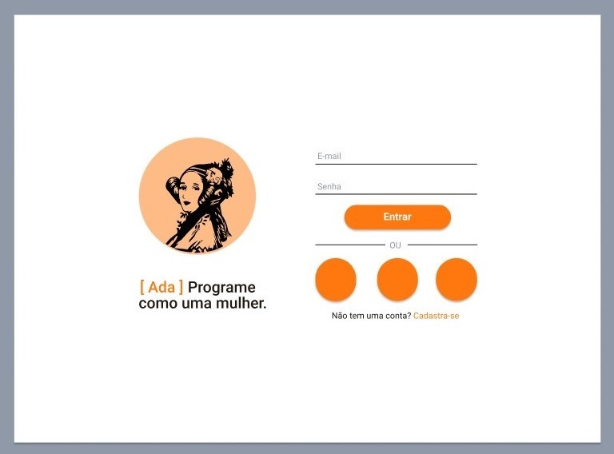

# [Ada]

Uma rede social que visa conectar mulheres que atuam, ou desejam atuar na área de tecnologia, num um ambiente seguro que promove troca de experiências e expanda conhecimento.

---
## Índice

- [1. Introdução](#1-introdução)
- [2. Planejamento e Organização](#2-planejamento-e-organização)
- [3. Processo criativo](#3-processo-criativo)
- [4. Desenvolvimento](#4-desenvolvimento)
- [5. Funcionamento](#5-funcionamento)

---
## 1. Introdução

Rede social desenvolvida em conjunto, pelas alunas/futuras Desenvolvedoras Front-end [Beatriz Penalva](https://github.com/beatrizpenalva), [Gabrielle Almeida](https://github.com/GabrielleAlmeida), [Julia Terin](https://github.com/JuliaTerin) durante o Bootcamp Laboratória - Turma SAP005.

### Sobre 

[Ada] é uma rede social para mulheres que atuam, ou querem atuar, como desenvolvedoras. É um espaço seguro e de compartilhamento de saberes , histórias e aprendizados.

Quem nos inspirou para o desenvolvimento deste projeto foi a  [Augusta Ada King](https://pt.wikipedia.org/wiki/Ada_Lovelace), mais conhecida como Ada Lovelace, considerada a primeira Programadora da História,que foi responsável pelo desenvolvimento de um algoritmo que permitiu à máquina analítica de Charles Babbage computar os valores de funções matemáticas.

O propósito desta Rede é auxiliar mulheres na formação umas das outras, conectadas podemos fortalecer e florescer essa área que  historicamente é tão nossa.

---
## 2. Planejamento e Organização

O planejamento e organização do projeto foi feito com método Kanban, utilizando o [Trello](https://trello.com/) como ferramenta. Veja nosso quadro [aqui](https://trello.com/b/0PEjsA2s/ada-rede-social)!

#### Experiência de usuário
Para desenvolver este aplicativo, alguns métodos de UX foram incorporados ao processo:
- Protopersonas criados;
- Protopersonas validadas com entrevistas;
- Histórias de usuários criadas.

### Personas

  

### Histórias de usuários

Com base nas personas validadas partimos para as histórias de usuários. Geramos quatro histórias, cada uma contemplando necessidades identificadas através das três entrevistas realizadas, assim, gerando etapas de trabalho com as definições de pronto.
As histórias são:

- História 1: "Eu como usuária, desejo ter acesso à aplicação por ser uma mulher com interesse no mundo da tecnologia"
- História 2: "Eu como usuária, desejo criar um perfil para ter acesso a rede de mulheres interessadas em estudar tecnologia"
- História 3: "Eu como usuária, desejo publicar textos para interagir com a rede"
- História 4: "Eu como usuária, desejo visualizar os posts das demais usuárias e poder curtir e responder para interagir com a rede"

Você pode acessar nossas histórias de usuario [1](https://trello.com/c/5bjq1Ybp/15-hist%C3%B3ria-1-eu-como-usu%C3%A1ria-desejo-ter-acesso-%C3%A0-aplica%C3%A7%C3%A3o-por-ser-uma-mulher-com-interesse-no-mundo-da-tecnologia), [2](https://trello.com/c/tn2pc25i/16-hist%C3%B3ria-2-eu-como-usu%C3%A1ria-desejo-criar-um-perfil-para-ter-acesso-a-rede-de-mulheres-interessadas-em-estudar-tecnologia), [3](https://trello.com/c/fmmifLKo/36-hist%C3%B3ria-3-eu-como-usu%C3%A1ria-desejo-publicar-textos-para-interagir-com-a-rede) e [4](https://trello.com/c/CYSdJ3aL/31-hist%C3%B3ria-4-eu-como-usu%C3%A1ria-desejo-visualizar-os-posts-das-demais-usu%C3%A1rias-e-poder-curtir-e-responder-para-interagir-com-a-rede) nos links com os critérios de aceitação e definições de pronto. 

---
## 3. Processo criativo

### Marca

[Ada]
Como já dito, o nome da marca foi baseada na Condessa de Lovelace, seu nome é envolto por colchetes, que são utilizados na declaração de arrays, usada para armazenar vários valores em uma única variável, que podem ser acessados juntos ou separadamente. Seu uso é uma alegoria a junção de pessoas e seus conhecimentos num só lugar, que pode ser acessado para ajudar, aprender ou ambos.

### Cores

A paleta de cores teve como base a cor laranja, na psicologia das cores laranja transmite alegria e confiança, sendo uma cor vibrante que estimula ação, apetite e a socialização. É uma cor de simbologia neutra, evitando o uso de cores estigmatizadas ao feminino. 
 
  

### Protótipo

O processo criativo se deu inicialmente com o desenvolvimento do protótipo criado com a ferramente [Figma](https://www.figma.com/) em mobile first, após pesquisa de cores e estilo.

  
  
  

---
## 4. Desenvolvimento

Fala do firebase como nuvem de banco de dados!
-responsivo

## 5. Funcionamento 

  

#### Criação e login de conta de usuário

- _Login_ com Firebase:
  - Para o _login_ e postagens na timeline, você pode usar
    [Firebase Authentication](https://firebase.google.com/docs/auth) e [Cloud Firestore](https://firebase.google.com/docs/firestore)
  - O usuário deve poder criar uma conta de acesso ou autenticar-se com conta de
    e-mail e senha e também com uma conta do Google.
- Validações:
  - Somente usuários com contas válidas têm acesso permitido.
  - Não haver usuários repetidos.
  - A conta do usuário deve ser um email válido.
  - O que o usuário digita no campo de senha (_input_) deve ser secreto.
- Comportamento:
  - Quando o formulário de registro ou login é enviado, ele deve ser validado.
  - Se houver erros, mensagens descritivas devem ser exibidas para ajudar o
    usuário.

#### Timeline/linha do tempo

- Validações:
  - Ao publicar, deve ser validado se há conteúdo no _input_.
- Comportamento:
  - Ao recarregar o aplicativo, é necessário verificar se o usuário está
    _logado_ antes de exibir o conteúdo,
  - Conseguir publicar um _post_.
  - Poder dar e remover _likes_ em uma publicação. Máximo de um por usuário.
  - Visualizar contagem de _likes_.
  - Poder excluir uma postagem específica.
  - Solicitar confirmação antes de excluir um _post_.
  - Ao clicar em editar um _post_, você deve alterar o texto para um _input_ que
    permite editar o texto e salvar as alterações.
  - Ao salvar as alterações, você deve voltar ao texto normal, mas com a
    informação editada.
  - Ao recarregar a página, poder ver os textos editados.

### 5.7 Considerações técnicas sobre front-end

- Separar a manipulação do DOM da lógica (separação de responsabilidades).
- Ter várias telas. Para isso, seu aplicativo deve ser um [Single Page
  Application
  (SPA)](https://pt.wikipedia.org/wiki/Aplicativo_de_p%C3%A1gina_%C3%BAnica)
- Alterar e persistir dados. Os dados que você adiciona ou modifica devem
  persistir por todo o aplicativo. Recomendamos que você use o
  [Firebase](https://firebase.google.com/) para isso também.

#### Testes unitários

- Lembre-se de que não há _setup_ de **testes** definido, isso dependerá da
  estrutura do seu projeto. Você não deve esquecer de pensar sobre os testes.
  Eles podem ajudar a definir a estrutura e sua lógica.

- Os testes de unidade devem cobrir no mínimo 70% de _statements_, _functions_,
  _lines_ e _branches_.

### 5.8 Considerações técnicas UX

- Faça pelo menos 2 entrevistas com os usuários.
- Faça um protótipo de baixa fidelidade.
- Verifique se a implementação do código segue as diretrizes do protótipo.
- Faça sessões de teste de usabilidade com o produto em HTML.

## 7. Entrega

O projeto será entregue subindo seu código no GitHub (`commit` /`push`) e a
interface será hospedada usando o [Firebase Hosting](https://firebase.google.com/docs/hosting).

